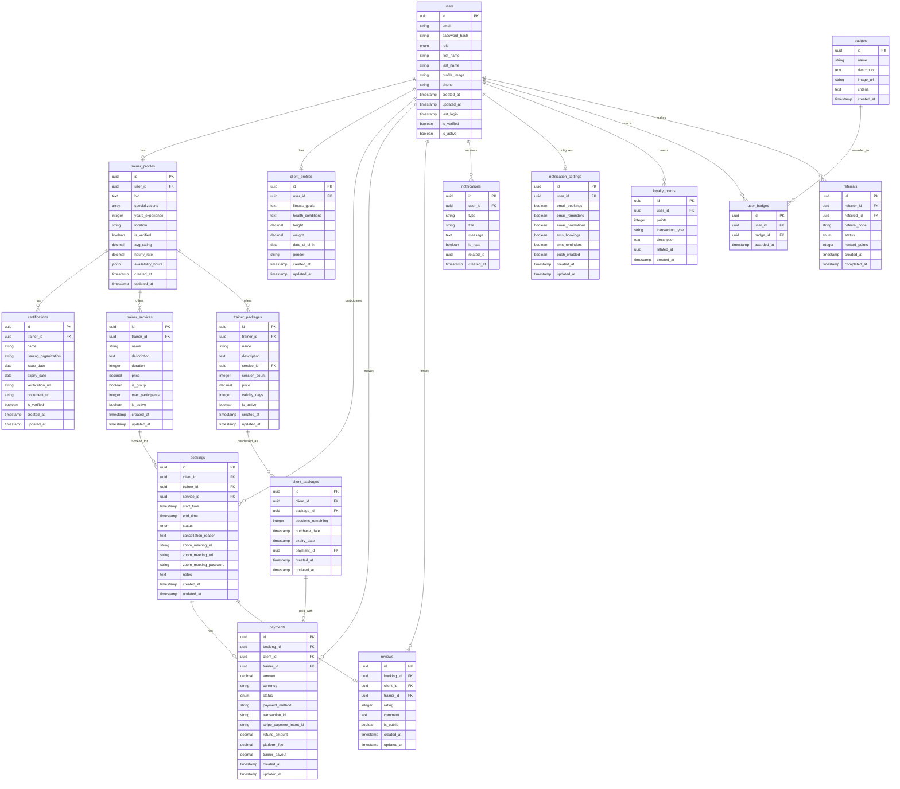

```mermaid
erDiagram
    users ||--o| trainer_profiles : has
    users ||--o| client_profiles : has
    trainer_profiles ||--o{ certifications : has
    trainer_profiles ||--o{ trainer_services : offers
    trainer_profiles ||--o{ trainer_packages : offers
    users ||--o{ bookings : participates
    users ||--o{ payments : makes
    users ||--o{ reviews : writes
    users ||--o{ notifications : receives
    users ||--o| notification_settings : configures
    users ||--o{ loyalty_points : earns
    users ||--o{ user_badges : earns
    users ||--o{ referrals : makes
    badges ||--o{ user_badges : awarded_to
    trainer_services ||--o{ bookings : booked_for
    trainer_packages ||--o{ client_packages : purchased_as
    bookings ||--o| payments : has
    bookings ||--o| reviews : receives
    client_packages ||--o| payments : paid_with
    
    users {
        uuid id PK
        string email
        string password_hash
        enum role
        string first_name
        string last_name
        string profile_image
        string phone
        timestamp created_at
        timestamp updated_at
        timestamp last_login
        boolean is_verified
        boolean is_active
    }
    
    trainer_profiles {
        uuid id PK
        uuid user_id FK
        text bio
        array specializations
        integer years_experience
        string location
        boolean is_verified
        decimal avg_rating
        decimal hourly_rate
        jsonb availability_hours
        timestamp created_at
        timestamp updated_at
    }
    
    certifications {
        uuid id PK
        uuid trainer_id FK
        string name
        string issuing_organization
        date issue_date
        date expiry_date
        string verification_url
        string document_url
        boolean is_verified
        timestamp created_at
        timestamp updated_at
    }
    
    client_profiles {
        uuid id PK
        uuid user_id FK
        text fitness_goals
        text health_conditions
        decimal height
        decimal weight
        date date_of_birth
        string gender
        timestamp created_at
        timestamp updated_at
    }
    
    trainer_services {
        uuid id PK
        uuid trainer_id FK
        string name
        text description
        integer duration
        decimal price
        boolean is_group
        integer max_participants
        boolean is_active
        timestamp created_at
        timestamp updated_at
    }
    
    bookings {
        uuid id PK
        uuid client_id FK
        uuid trainer_id FK
        uuid service_id FK
        timestamp start_time
        timestamp end_time
        enum status
        text cancellation_reason
        string zoom_meeting_id
        string zoom_meeting_url
        string zoom_meeting_password
        text notes
        timestamp created_at
        timestamp updated_at
    }
    
    payments {
        uuid id PK
        uuid booking_id FK
        uuid client_id FK
        uuid trainer_id FK
        decimal amount
        string currency
        enum status
        string payment_method
        string transaction_id
        string stripe_payment_intent_id
        decimal refund_amount
        decimal platform_fee
        decimal trainer_payout
        timestamp created_at
        timestamp updated_at
    }
    
    reviews {
        uuid id PK
        uuid booking_id FK
        uuid client_id FK
        uuid trainer_id FK
        integer rating
        text comment
        boolean is_public
        timestamp created_at
        timestamp updated_at
    }
    
    trainer_packages {
        uuid id PK
        uuid trainer_id FK
        string name
        text description
        uuid service_id FK
        integer session_count
        decimal price
        integer validity_days
        boolean is_active
        timestamp created_at
        timestamp updated_at
    }
    
    client_packages {
        uuid id PK
        uuid client_id FK
        uuid package_id FK
        integer sessions_remaining
        timestamp purchase_date
        timestamp expiry_date
        uuid payment_id FK
        timestamp created_at
        timestamp updated_at
    }
    
    notifications {
        uuid id PK
        uuid user_id FK
        string type
        string title
        text message
        boolean is_read
        uuid related_id
        timestamp created_at
    }
    
    notification_settings {
        uuid id PK
        uuid user_id FK
        boolean email_bookings
        boolean email_reminders
        boolean email_promotions
        boolean sms_bookings
        boolean sms_reminders
        boolean push_enabled
        timestamp created_at
        timestamp updated_at
    }
    
    loyalty_points {
        uuid id PK
        uuid user_id FK
        integer points
        string transaction_type
        text description
        uuid related_id
        timestamp created_at
    }
    
    badges {
        uuid id PK
        string name
        text description
        string image_url
        text criteria
        timestamp created_at
    }
    
    user_badges {
        uuid id PK
        uuid user_id FK
        uuid badge_id FK
        timestamp awarded_at
    }
    
    referrals {
        uuid id PK
        uuid referrer_id FK
        uuid referred_id FK
        string referral_code
        enum status
        integer reward_points
        timestamp created_at
        timestamp completed_at
    }
```
